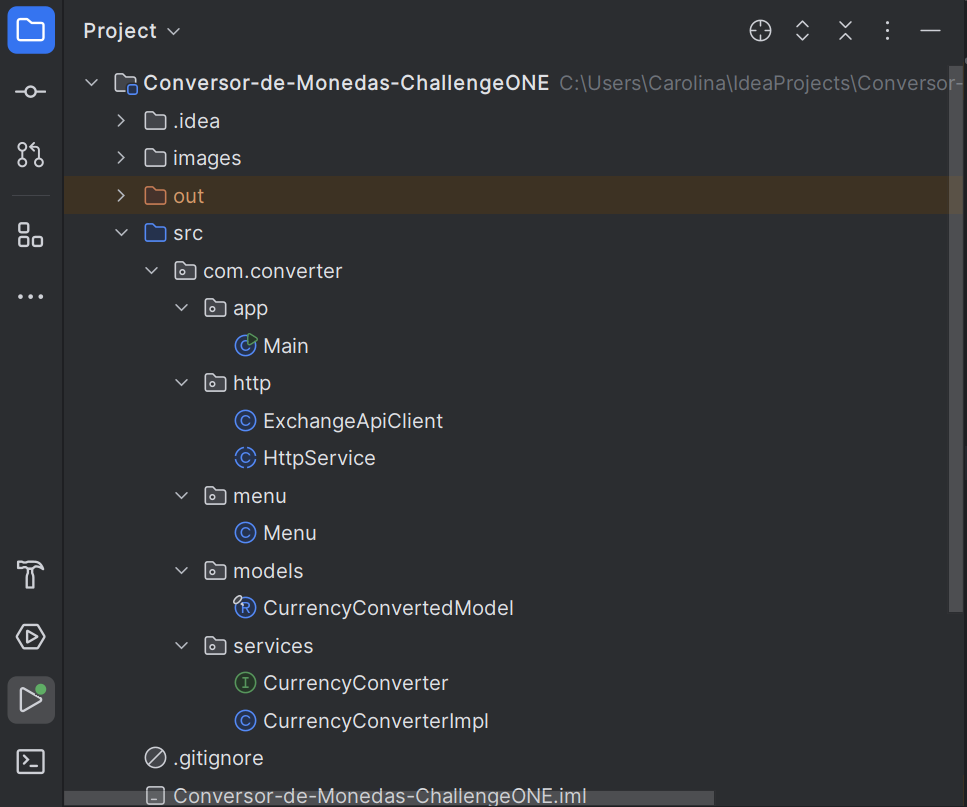
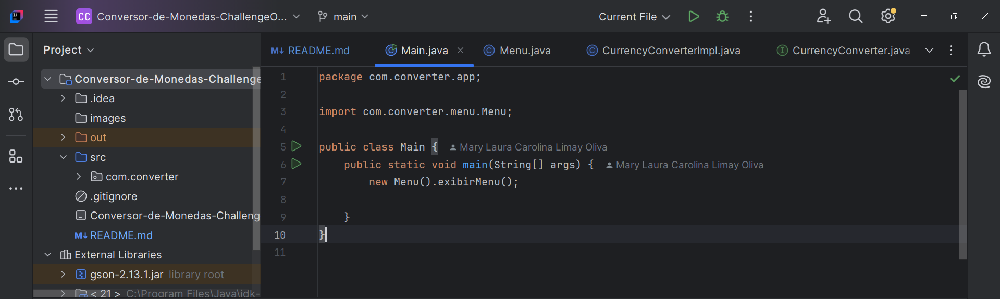
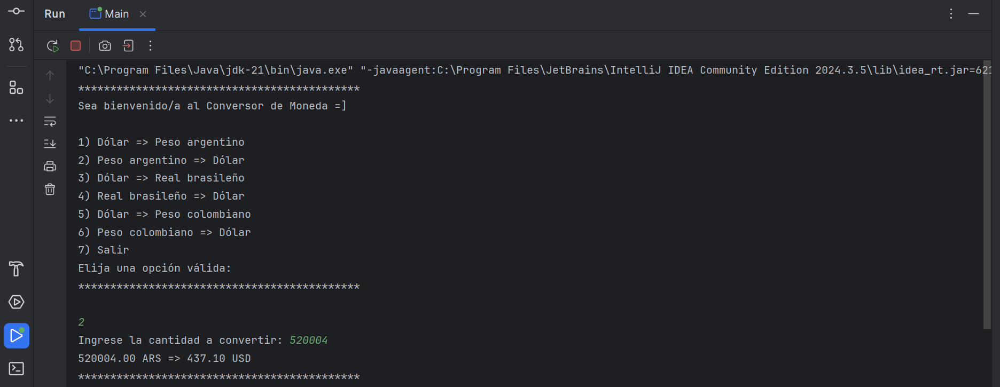
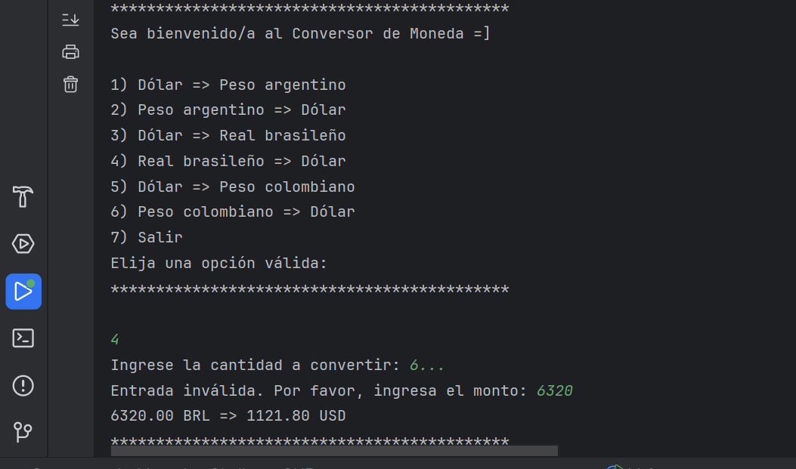
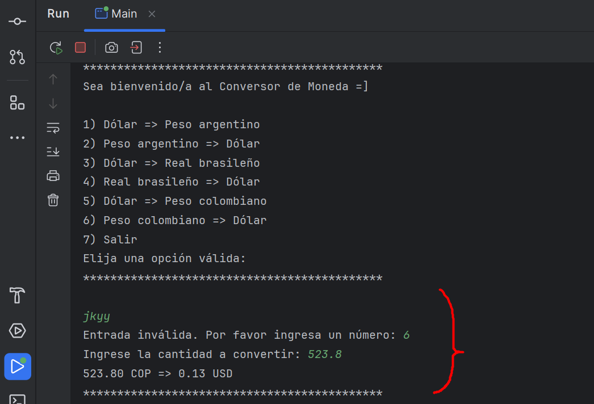

# Conversor de Monedas - Challenge ONE

Segundo proyecto del desafío **Oracle Next Education (ONE)**, Grupo 8 - 2025, Formación Java Backend.

## 📌 Descripción

Este proyecto es una aplicación de consola desarrollada en Java que permite convertir montos entre diferentes monedas. Fue creado como parte del programa de formación **Oracle Next Education** en colaboración con **Alura Latam**, con el objetivo de aplicar conceptos de programación orientada a objetos y manejo de APIs externas.

## 🛠️ Tecnologías Utilizadas

- **Lenguaje de programación:** Java
- **Paradigma:** Programación Orientada a Objetos (POO)
- **IDE recomendado:** IntelliJ IDEA 
- **Control de versiones:** Git y GitHub
- **Librerías usadas:** GSON, la cual sirve para el parseo de objetos java a JSON y viceversa. La puedes descargar de la web: https://mvnrepository.com/artifact/com.google.code.gson/gson


## 🚀 Funcionalidades

- Conversión de monedas utilizando tasas de cambio actualizadas.
- Interfaz de usuario en consola para una interacción sencilla.
- Manejo de errores y validación de entradas del usuario.

## 📂 Estructura del Proyecto

El proyecto está organizado de la siguiente manera:



- `Main.java`: Clase principal que inicia la aplicación y gestiona la interacción con el usuario.
- `Menu.java`: Clase que se encarga de mostrar al usuario las diferentes opciones que existen de conversión de monedas, así como también ejecuta la validación de los datos ingresados por el usuario.
- `CurrencyConverterModel.java`: Es una clase récord (inmutable) que servirá para trasladar los datos obtenidos de la API que son formato JSON a un objeto Java.
- `CurrencyConverter.java`: Es una clase interfaz que cuando se implemente podra hacer las conversiones de monedas.
- `CurrencyConverterImpl.java`: Al implementar el método de CurrencyConverter, podrá obtener el objeto java CurrentConverterModel con los resultados del llamado a la API.
- `ExchangeAPIClient.java`: Maneja las solicitudes a la API externa para obtener las tasas de cambio actuales.
- `HTTPService.java`: Es una clase abstracta que guarda las funciones a implementar para poder realizar requests a la API externa.


## ⚙️ Requisitos

- **Java Development Kit (JDK) 17** o superior instalado en tu sistema.
- **Conexión a Internet** para obtener las tasas de cambio actualizadas desde la API.

## 🧪 Ejecución del Proyecto

### 1. Clona este repositorio en tu máquina local:

   ```bash
   git clone https://github.com/Lunisa202/Conversor-de-Monedas-ChallengeONE.git
   ```

### 2. Abre el proyecto en tu Intellij Idea.

### 3. Descarga el .jar de GSON y agregalo como librería externa:

#### A. Copiar el archivo `.jar` al proyecto

- Crea una carpeta llamada `lib` en la raíz del proyecto si no existe.
- Copia el archivo `.jar` (por ejemplo, `gson-2.10.1.jar`) dentro de la carpeta `lib`.

#### B. Abrir la configuración del proyecto

- Abre IntelliJ IDEA y carga tu proyecto.
- Ve al menú `File` → `Project Structure...` o usa el atajo `Ctrl + Alt + Shift + S`.

#### C. Agregar el `.jar` como dependencia

- En el panel izquierdo, selecciona `Modules`.
- Haz clic en la pestaña `Dependencies`.
- Presiona el botón `+` (agregar).
- Selecciona `JARs or directories`.
- Busca el archivo `.jar` que colocaste en la carpeta `lib`.
- Asegúrate de que el "Scope" esté como `Compile`.
- Haz clic en `Apply` y luego en `OK`.

#### D. Verificar que se importó correctamente

- Abre una clase en tu proyecto.
- Intenta importar una clase desde la librería `.jar`. Por ejemplo:

  ```java
  import com.google.gson.Gson;


### 4. Ejecuta la clase `Main.java` para iniciar la aplicación.

### 5. Sigue las instrucciones en la consola para realizar conversiones de moneda.

## 📸 Capturas de Pantalla
### Ejecución de la clase main


### Interfaz de linea de comandos


### Validación de las opciones a elegir por el usuario (siempre será un número double)



### Validación del monto de dinero ingresado por el usuario (siempre será un número double)


## 👩‍💻 Autor

- **Carolina Limay** - [GitHub](https://github.com/Lunisa202)

## 📄 Licencia

Este proyecto está bajo la Licencia MIT. Consulta el archivo [LICENSE](LICENSE) para más detalles.
